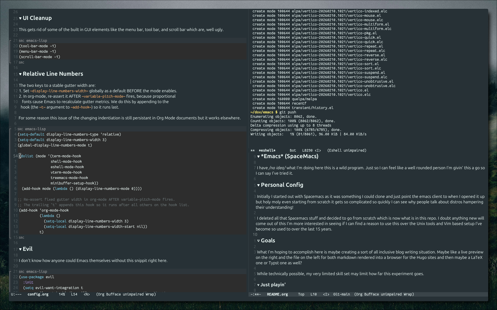

* *Emacs* (SpaceMacs)

I have /no idea/ what I'm doing here this is a wild program. Just so I can feel like a well rounded person I'm givin' this a go so I can say I've tried it. 

* Personal Config

Initially I started out with Spacemacs as it was something I could clone and just point the emacs client to when I opened it up but holy moly even starting from scratch it gets so complicated so quickly I can see why people talk about distros hampering their understanding!

I deleted all that Spacemacs stuff and decided to go from scratch which is now what is in this repo. I doubt anything new will come out of this I'm more interested in seeing if I can find a reason to use this over the Unix tools and Vim based setup I've become so used to over the last 15 years.

** Goals

What I'm hoping to accomplish here is maybe creating a sort of all inclusive blog writing situation. Maybe like a live preview on the right and the file on the left for both markdown rendered into a browser for the Hugo sites and then maybe a LaTeX one or Typst one as well? 

While technically possible, my very limited skill set may limit how far this experiment goes. 

**** Just playin'

wrote this in org mode lol i'm a pro
