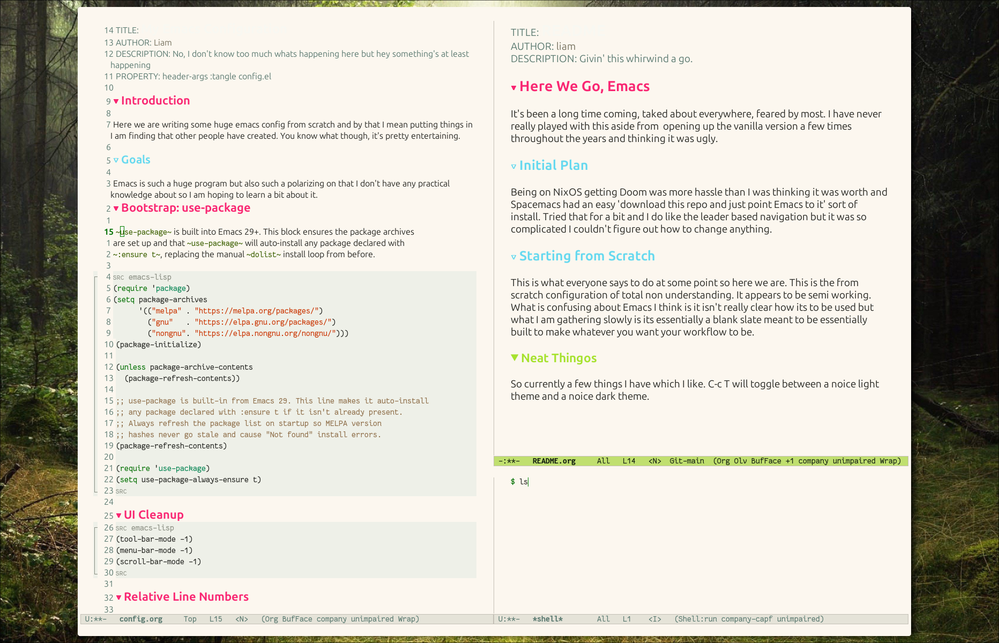
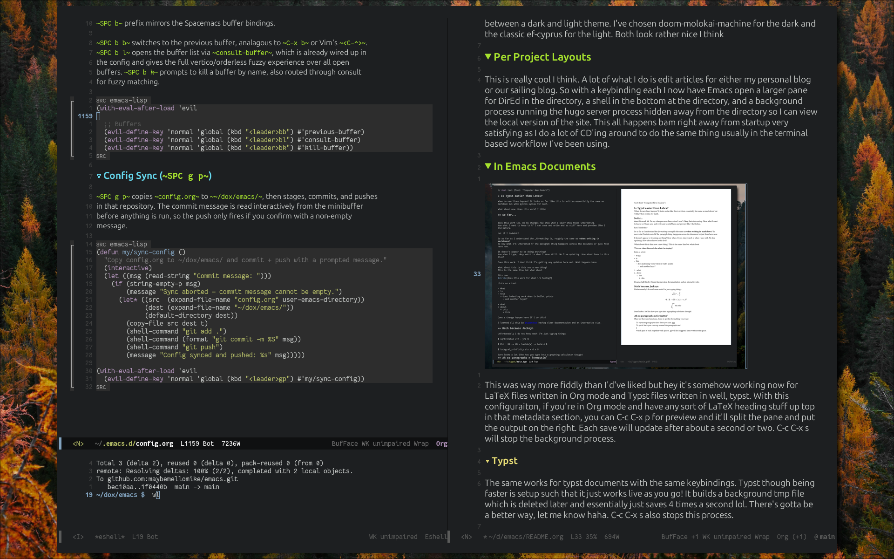
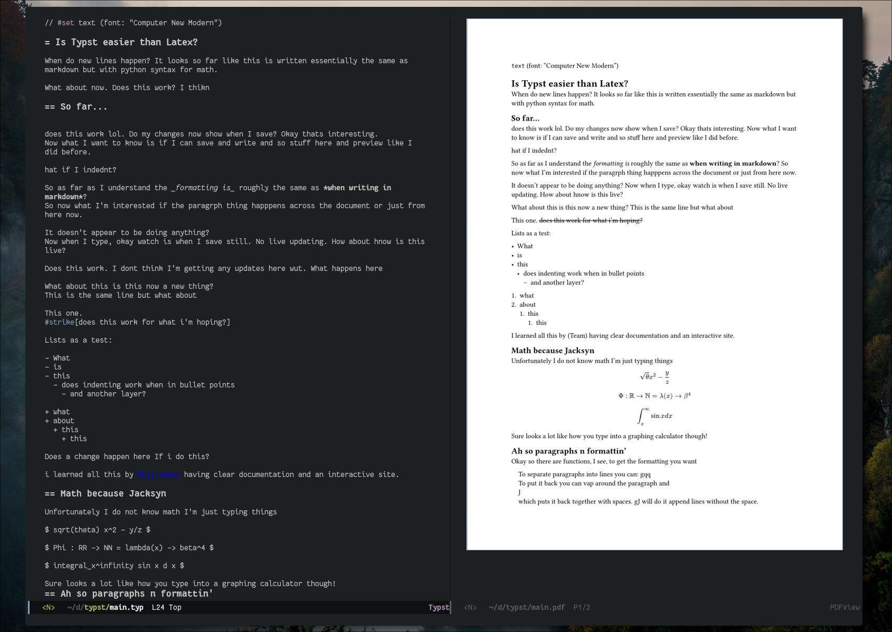

#+TITLE: Ding-Macs (Emacs for Dinguses)
#+AUTHOR: liam
#+DESCRIPTION: Givin' this whirwind a go.

* Here We Go

It's been a long time coming, taked about everywhere, feared by most. I have never really played with this aside from opening up the vanilla version a few times throughout the years and thinking it was ugly.

** Starting from Scratch

This is what everyone says to do at some point so here we are. This is the from scratch configuration of total non understanding. It appears to be semi working. What is confusing about Emacs I think is it isn't really clear how its to be used but what I am gathering slowly is its essentially a blank slate meant to be essentially built to make whatever you want your workflow to be.

** Neat Features I've Got Workin'

*** Theme Switching

This you can see in the screenshots above. I've always sorta wanted this in my window manager so its cool it works here. With C-c T I can hop back and forth between a dark and light theme. I've chosen doom-molokai-machine for the dark and the classic ef-cyprus for the light. Both look rather nice I think 

*** Per Project Layouts

This is really cool I think. A lot of what I do is edit articles for either my personal blog or our sailing blog. So with a keybinding each I now have Emacs open a larger pane for DirEd in the directory, a shell in the bottom at the directory, and a background process running the hugo server process hidden away from the directory so I can view the local version of the site. This all happens bam right away from startup very satisfying as I do a lot of CD'ing around to do the same thing usually in the terminal based workflow I've been using. 

*** In Emacs Documents

This was way more fiddly than I'd've liked but hey it's somehow working now for LaTeX files written in Org mode and Typst files written in well, typst. With this configuraiton, if you're in Org mode and have any sort of LaTeX heading stuff up top in that metadata section, you can C-c C-x p for preview and it'll split the pane and put the output on the right. Each save will update after about a second or two. C-c C-x s will stop the background process. 

**** Typst

The same works for typst documents with the same keybindings. Typst though being faster is setup such that it just works live as you go! It builds a background tmp file which is deleted later and essentially just saves 4 times a second lol. There's gotta be a better way, let me know haha. Once the preview is opened ~C-c p l~ will start live previewing. ~C-c p T~ will stop the entire process. 

** Window Management?

Realizing Emacs was sort of made pre the era of like fancy graphical interfaces this part seems a bit funny now but I'm actually sorta liking how I have this setup. I have a focus change with C-c then hjkl to move where the active pane is, then C-c m + hjkl will move your active pane in that direction. Otherwise the standard confusing Emacs binds are true with C-x 3 to split vertically, 0 closes it, and so on. 

**** Leader Key

I have added for window management and a few other things an additional set of keybinds that start with ~SPC~ much like the Spacemacs method. This seems to work better with the window management I have going already. 

** Repeat Command Macros
This is pretty nifty. Though the paths are hardcoded these work well for me. I can now ~SPC g p~ and automatically just get prompted for a commit message and my Emacs configuration github repo is updated to my current configuration.

I have the same for my entire dotfiles directory which works well. Along with the dotfiles directory github update I also have a keybinding which opens up a layout with automatic fuzzy finding within the directory, a shell on the bottom 4th of the frame, and a blank window which will open whatever is selected from the fuzzy finding. I can ~SPC g r~ to be just prompted for my password and it'll run ~doas nixos-rebuild test --flake .~ within the correct directory.

** System Requirements

Of course this can't be totally modular, unfortunately. There are a few things I am using here in the config which are off of the system. Currently they are as follows

*** Fonts
I have dynamic fonts setup so the differences are clear and honestly cool looking between code and such and prose.

I am using Fantasque Mono Sans from the Nerd Fonts package for the monospace or "fixed pitched" (as Emacs calls it) fonts. I am using the classic LaTeX New Computer Modern fonts for "variable pitched fonts", currently New Computer Modern Sans 10.

*** Documents

Currently I have both the TeXliveFull package and typst installed on my machine. These are available across lots of distros and on MacOS if I'm not mistaken with Nix or homebrew if you're still not migrated over to Nix (which you should be lol). These are required for the Org --> output documents and live viewing setups within this ever growing configuration.

*** Spell Check
This isn't working yet unfortunately due to NixOS's paths and such. But I have hunspell as the backend for FlySpell, the Emacs plugin for spelling. You install hunspell on your machine as well as the dictonaries for the languges you are typing in, or at least hoping to spell check in lol.   
